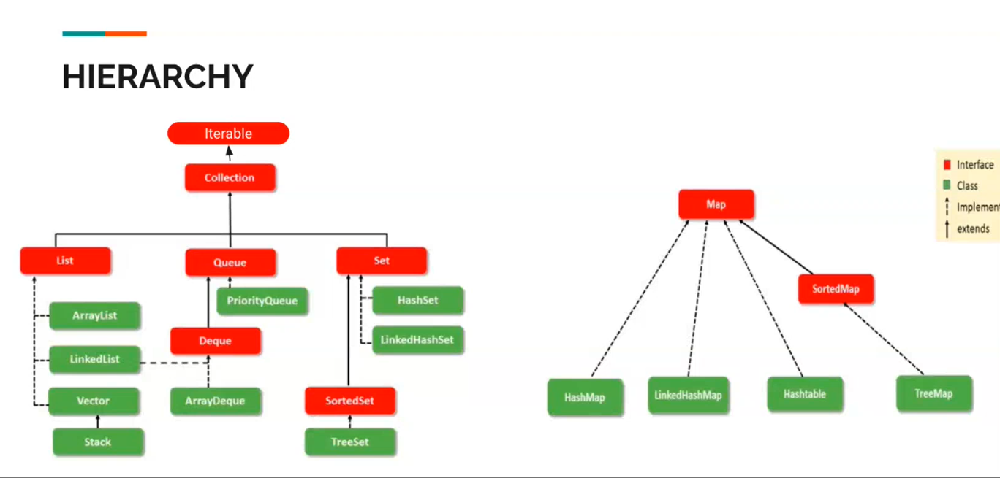

#### What is Collection Framework?
    - Single unit of objects 
    - can store both Homogeneous and Heterogeneous Data
    - Provides a set of interfaces and classes to implement various Data Structures and algorithms

#### Collection Hierarchy
